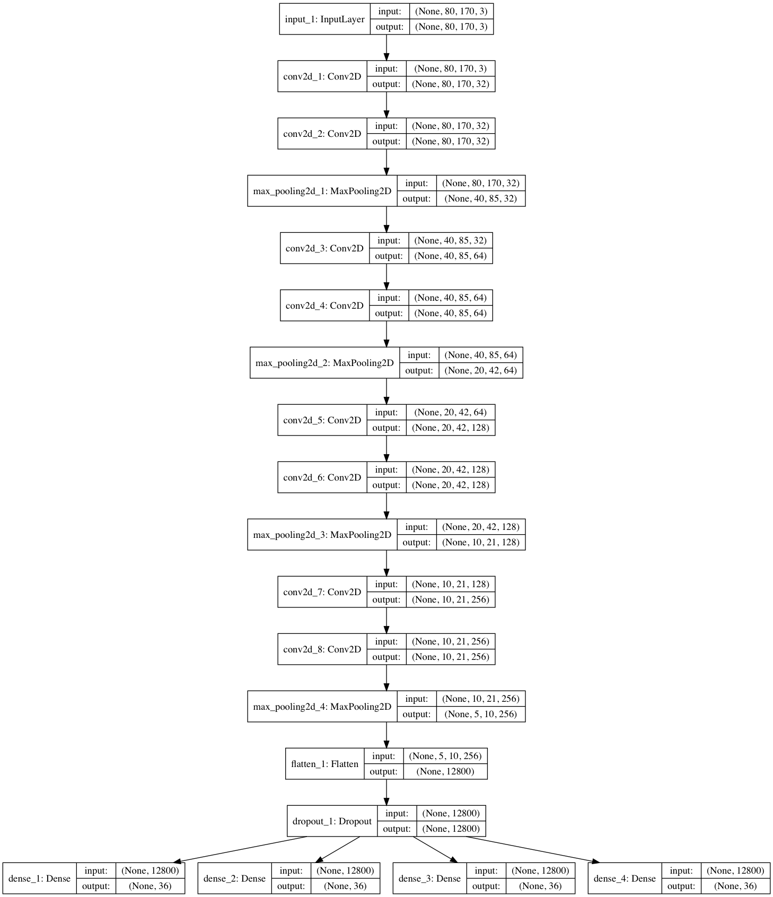
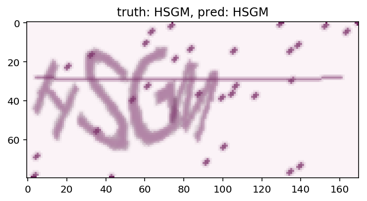
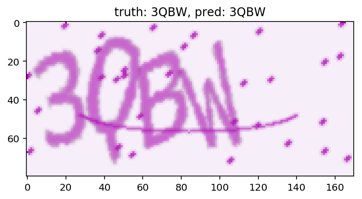
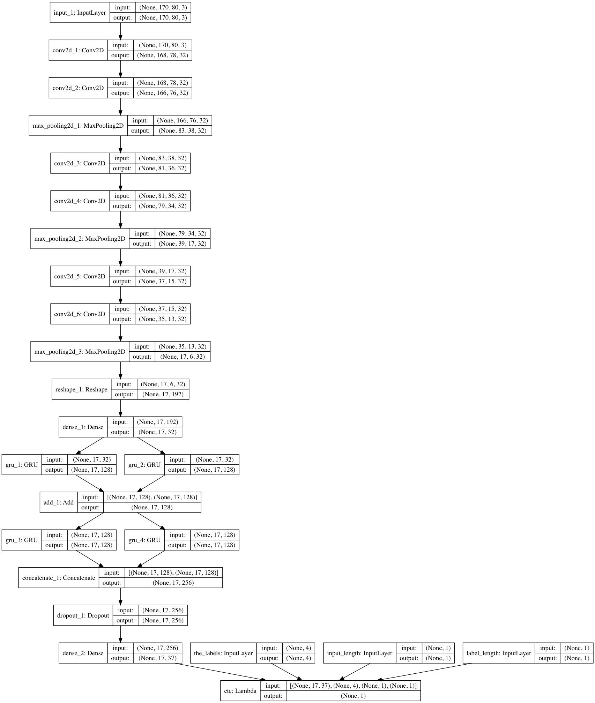
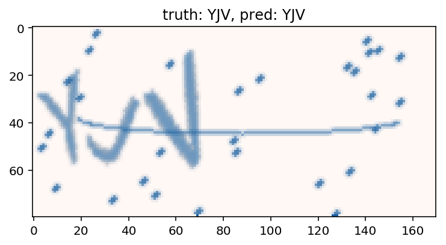
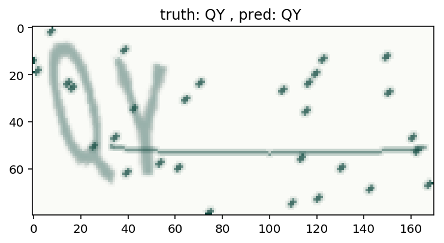

# 验证码识别


4位固定长度验证码，最终结果**accuracy: 0.9706, loss: 0.5285** = 0.1078 + 0.1180 + 0.1762 + 0.1265。非固定长度验证码，采用CTC Loss，准确率也达到82%。

## 固定长度验证码

神经网络模型如下，



核心就是神经网络的设计，这里基于作者的基础做了很多尝试，总结经验如下：

- 神经网络模型太简单（比如只有2层卷积网络），会有strong bias，最终难以达到一个好的预测结果
- 模型太复杂（比如10层），收敛会变得非常缓慢。当然我相信数据量充足（这里几乎是无限）的情况下，可以达到更好的效果，不过我等不及了。这是一个trade off
- 2层卷积+1层Pooling的组合多次感觉效果最佳。我尝试过“2层卷积+1层Pooling”和"3层卷积+1层Pooling"多种情况，都不如之前。
- strides=1, padding='same'是蛮不错的选择，虽然默认是valid
- 个人觉得，我们有必要不断做卷积操作提起特征，然后Pooling，直到图形的size缩小到一定经验值以内（比如10），这样才算是最充分“榨取”了图像的特征信息。再多卷积可能得不到更多有价值信息了，因为已经只有10 size，而Conv的kernel_size和Stride结合起来会马上超过。
- Adadelta, Adagrad, RMSprop是不错的Optimizor选择。Ref:[深度学习最全优化方法总结比较（SGD，Adagrad，Adadelta，Adam，Adamax，Nadam）](https://zhuanlan.zhihu.com/p/22252270)

### 训练结果





### 其它

- `captcha.generate_image`生成的验证码是(height, width, channel)的格式，不是(width, height, channel)
- 使用generator而不是fixed size datasets，这里X和y的格式需要注意

```
X = np.zeros((batch_size, height, width, 3), dtype=np.uint8)
# not like this
# y = np.zeros((batch_size, n_len, n_class))
y = [np.zeros((batch_size, n_class), dtype=np.uint8) for i in range(n_len)]
```

因为我们最终预测的结果是4个完全独立无关的字母/数字，它们的组合是无意义的，因此预测结果最好是4个，而不是1个'字符串'。神经网络肯定会自动感知到预测的第一个和图像最左边的相关，最后一个和最右边相关。

## 非固定长度验证码

### 神经网络模型



3层卷积/卷积/池化模型，再引入2层GRU，正/反叠加（有add，有concatenate），引入Dropout。其中`dense_2`的输出为`(None, 17, 37)`，可以这样理解：None表示batch num，17相当于图片的宽度被分割为17个做识别，37是character的总个数+1（我理解是额外表示空格）。

### CTC Loss

CTC Loss的定义可以Google，它神奇的地方在于可以计算2个非等长序列的Loss（本例中就是图像被分割的17(可变)“块”和序列的非固定长度，从3到4的验证码长度）。从而实现反向传递用于神经网络。不过训练过程收敛很慢，需要耐心。

```
ctc_batch_cost(y_true, y_pred, input_length, label_length) 
```

-  **y\_true: 实际序列，或称labels。本例中是(None, MAX_CAPTCHA_LEN)，每一项是一个验证码**
-  **y\_pred: 预测序列，本例中是(None, 17, \<channels\>)，每一项是一个“图像”**
-  **input\_length: 输入,即`y_pred`的长度，(None, 1),本例中是输入图像的“长度”，为17，即把图像划分成了17“块”。不过实际中要减去2，因为RNN的前2项一般都会废弃。**
-  **label\_length: 预测目标,即`y_true/labels`的长度，(None, 1),本例中是每一个验证码的长度。**

**总结一句话，一个batch通过CTC-Loss计算，计算参数是batch中每一项中，有2个序列的内容和各自长度。**

### Train Objective

这个模型一个有意思的地方是整个模型最终的输出，正好也是其Loss，模型compile如下

```
ctc_model.compile(loss=lambda y_true, y_pred: y_pred, optimizer='adadelta')
```

这样便可以非常好地讲模型的生成器（也就是代码中的base_model）和CTC Loss的计算结合在一起，并且模型的训练目标loss也得到很好的表示。

### Generator

`def ctc_gen(batch_size=32, is_dynamic_len = False)`

这个generator可以生成CTC训练需要的输入、输出batch。其中输入是由4部分组成，\[generate_images, labels, input\_length, label\_length\]，输出是全0（符合期望的数据，期望其CTC Loss为0）

### 自定义评估Keras Callback

每次epoch完成的时候，运行自定义callback，自定义模型评估。见代码`class ModelEvaluator(Callback)`

### 训练结果





## 其它

- captcha\_generator.generate\_image得到的图片plt.imshow()刚好OK，因为它们都是height,width,channel格式的，而我们的理解和模型经常需要转化为width,height,channel的格式，所以显示的时候需要transpose

## Ref

灵感与部分代码来自 [使用 Keras 来破解 captcha 验证码](https://ypwhs.github.io/captcha/)
